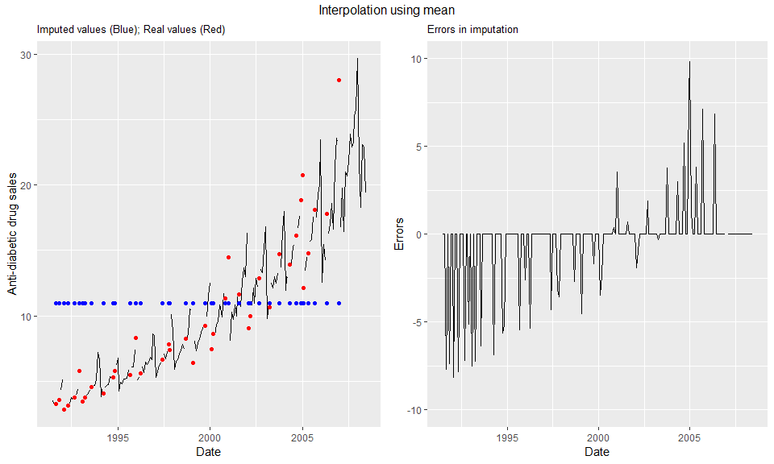

Overview
--------

For data scientists, data preparation could easily be the second most frustrating tasks, right after explaining their models to other departments. Missing value treatment is a key part of data preparation and knowing how to handle it well can reduce the excruciating pain one feels after seeing a poor RMSE. Chapter 13 talks about some of the ways you could handle missing data in your dataset, this walkthrough takes it further focusing specifically on timeseries data.

Who cares? I have mean, median & mode. No! You should care, time series problems are not that straight-forward, most often time series are accompanied with forecasting tasks and most algorithms won’t allow missing data. Imputation using mean, median & mode might hide the trend or seasonal patterns, removing missing data points might reduce information contained in other features for that row. Don’t worry we have imputeTS to help us out.

But first you must ask yourself two questions: 1) Is there any identifiable reason for it? OR 2) Are they missing at random? You find that your time series has missing data and decide to run an investigation.

Is there any identifiable reason for it? Let’s take the example of a bakery. You are forecasting sales of cakes at day level and found data missing is linked to holidays. One way could be to create a flag that could help your forecasting algorithm understand this pattern. If sales are missing if your cakes were out of stock or the baker was on leave such flags won’t work as you cannot predict these events future. Imputation is ideal for treating such cases. Are they missing at random? Lucky you, it’s missing at random. You have only one option - imputation.

Enough said let’s impute this missing piece into our toolkit!

Dataset : a10 "Monthly anti-diabetic drug sales in Australia from 1992 to 2008"

For this walthrough we will use two copies of the a10 dataset.

1.  The original dataset from the fpp package

``` r
complete_a10 <- fpp::a10
```

1.  Let's create missing values and check the performance of various imputate functions on hidden values.

``` r
set.seed(134)
missatrand_a10 <- complete_a10
missatrand_a10[sample(length(complete_a10),0.2*length(complete_a10))] <- NA 
```

Let's analyse this timeseries graphically
-----------------------------------------

``` r
plot(missatrand_a10)
```


Looks like the series has [multiplicative seasonality](https://otexts.org/fpp2/classical-decomposition.html). Let's transform it into additive to see if seaonality appears more clearly.

``` r
plot(log(missatrand_a10))
```


Wow, it shows a clear seasonal pattern with an increasing trend.

#### What if we decompose it into into its components

``` r
plot(decompose(missatrand_a10, type = "multiplicative"))
```

    ## Error in na.omit.ts(x): time series contains internal NAs

As mentioned above, we must treat the missing values before we do this.

``` r
library(imputeTS)
```

    ## 
    ## Attaching package: 'imputeTS'

    ## The following object is masked from 'package:tseries':
    ## 
    ##     na.remove

    ## The following object is masked from 'package:zoo':
    ## 
    ##     na.locf

#### Let's visualize these missing values

``` r
plotNA.distribution(missatrand_a10)
```


``` r
statsNA(missatrand_a10)
```

    ## [1] "Length of time series:"
    ## [1] 204
    ## [1] "-------------------------"
    ## [1] "Number of Missing Values:"
    ## [1] 40
    ## [1] "-------------------------"
    ## [1] "Percentage of Missing Values:"
    ## [1] "19.6%"
    ## [1] "-------------------------"
    ## [1] "Stats for Bins"
    ## [1] "  Bin 1 (51 values from 1 to 51) :      13 NAs (25.5%)"
    ## [1] "  Bin 2 (51 values from 52 to 102) :      8 NAs (15.7%)"
    ## [1] "  Bin 3 (51 values from 103 to 153) :      10 NAs (19.6%)"
    ## [1] "  Bin 4 (51 values from 154 to 204) :      9 NAs (17.6%)"
    ## [1] "-------------------------"
    ## [1] "Longest NA gap (series of consecutive NAs)"
    ## [1] "3 in a row"
    ## [1] "-------------------------"
    ## [1] "Most frequent gap size (series of consecutive NA series)"
    ## [1] "1 NA in a row (occuring 29 times)"
    ## [1] "-------------------------"
    ## [1] "Gap size accounting for most NAs"
    ## [1] "1 NA in a row (occuring 29 times, making up for overall 29 NAs)"
    ## [1] "-------------------------"
    ## [1] "Overview NA series"
    ## [1] "  1 NA in a row: 29 times"
    ## [1] "  2 NA in a row: 4 times"
    ## [1] "  3 NA in a row: 1 times"

``` r
plotNA.gapsize(missatrand_a10)
```


#### Imputing missing values

###### Method 1

``` r
imp <- na.mean(missatrand_a10)
p1<-as.tibble(cbind(Date = as.yearmon(time(missatrand_a10)), 
                missatrand = missatrand_a10,complete_a10 = complete_a10,imputed_val = imp))%>% 
                mutate(imputed_val = ifelse(is.na(missatrand),imputed_val,NA),
                       complete_a10 = ifelse(is.na(missatrand),complete_a10,NA)
                       )%>%
  ggplot(aes(x=Date)) + 
    #geom_line(aes(y=missatrand),color="red")+
    geom_line(aes(y=missatrand),color = "black")+
    geom_point(aes(y=imputed_val),color = "blue")+
    geom_point(aes(y=complete_a10),color = "red")+
    ylab("Anti-diabetic drug sales")+
    ggtitle("Imputed values (Blue); Real values (Red) ")+
    theme(plot.title = element_text(size = 10))

p2 <- ggplot() +
  geom_line(aes(y = complete_a10-imp, x = as.yearmon(time(missatrand_a10)) )) +
  ylim(-10,10) +
  ylab("Errors")+
  xlab("Date")+
  ggtitle(paste("Errors in imputation"))+
  theme(plot.title = element_text(size = 10))

grid.arrange(p1, p2, ncol=2,top="Interpolation using mean")
```

 \#\#\#\#\#\# Method 2

``` r
imp <- na.ma(missatrand_a10)
p1<-as.tibble(cbind(Date = as.yearmon(time(missatrand_a10)), 
                missatrand = missatrand_a10,complete_a10 = complete_a10,imputed_val = imp))%>% 
                mutate(imputed_val = ifelse(is.na(missatrand),imputed_val,NA),
                       complete_a10 = ifelse(is.na(missatrand),complete_a10,NA)
                       )%>%
  ggplot(aes(x=Date)) + 
    #geom_line(aes(y=missatrand),color="red")+
    geom_line(aes(y=missatrand),color = "black")+
    geom_point(aes(y=imputed_val),color = "blue")+
    geom_point(aes(y=complete_a10),color = "red")+
    ylab("Anti-diabetic drug sales")+
    ggtitle("Imputed values (Blue); Real values (Red) ")+
    theme(plot.title = element_text(size = 10))

p2 <- ggplot() +
  geom_line(aes(y = complete_a10-imp, x = as.yearmon(time(missatrand_a10)) )) +
  ylim(-10,10) +
  ylab("Errors")+
  xlab("Date")+
  ggtitle(paste("Errors in imputation"))+
  theme(plot.title = element_text(size = 10))

grid.arrange(p1, p2, ncol=2,top="Interpolation using n-Moving Averages")
```

 \#\#\#\#\#\# Method 3

``` r
imp <- na.kalman(missatrand_a10,model = "auto.arima")
p1<-as.tibble(cbind(Date = as.yearmon(time(missatrand_a10)), 
                missatrand = missatrand_a10,complete_a10 = complete_a10,imputed_val = imp))%>% 
                mutate(imputed_val = ifelse(is.na(missatrand),imputed_val,NA),
                       complete_a10 = ifelse(is.na(missatrand),complete_a10,NA)
                       )%>%
  ggplot(aes(x=Date)) + 
    #geom_line(aes(y=missatrand),color="red")+
    geom_line(aes(y=missatrand),color = "black")+
    geom_point(aes(y=imputed_val),color = "blue")+
    geom_point(aes(y=complete_a10),color = "red")+
    ylab("Anti-diabetic drug sales")+
    ggtitle("Imputed values (Blue); Real values (Red) ")+
    theme(plot.title = element_text(size = 10))

p2 <- ggplot() +
  geom_line(aes(y = complete_a10-imp, x = as.yearmon(time(missatrand_a10)) )) +
  ylim(-10,10) +
  ylab("Errors")+
  xlab("Date")+
  ggtitle(paste("Errors in imputation"))+
  theme(plot.title = element_text(size = 10))

grid.arrange(p1, p2, ncol=2,top="Interpolation using Auto.arima")
```


###### Method 4

``` r
imp <- na.seasplit(missatrand_a10)
p1<-as.tibble(cbind(Date = as.yearmon(time(missatrand_a10)), 
                missatrand = missatrand_a10,complete_a10 = complete_a10,imputed_val = imp))%>% 
                mutate(imputed_val = ifelse(is.na(missatrand),imputed_val,NA),
                       complete_a10 = ifelse(is.na(missatrand),complete_a10,NA)
                       )%>%
  ggplot(aes(x=Date)) + 
    #geom_line(aes(y=missatrand),color="red")+
    geom_line(aes(y=missatrand),color = "black")+
    geom_point(aes(y=imputed_val),color = "blue")+
    geom_point(aes(y=complete_a10),color = "red")+
    ylab("Anti-diabetic drug sales")+
    ggtitle("Imputed values (Blue); Real values (Red) ")+
    theme(plot.title = element_text(size = 10))

p2 <- ggplot() +
  geom_line(aes(y = complete_a10-imp, x = as.yearmon(time(missatrand_a10)) )) +
  ylim(-10,10) +
  ylab("Errors")+
  xlab("Date")+
  ggtitle(paste("Errors in imputation"))+
  theme(plot.title = element_text(size = 10))

grid.arrange(p1, p2, ncol=2,top="Seasonally splitted interpolation")
```


